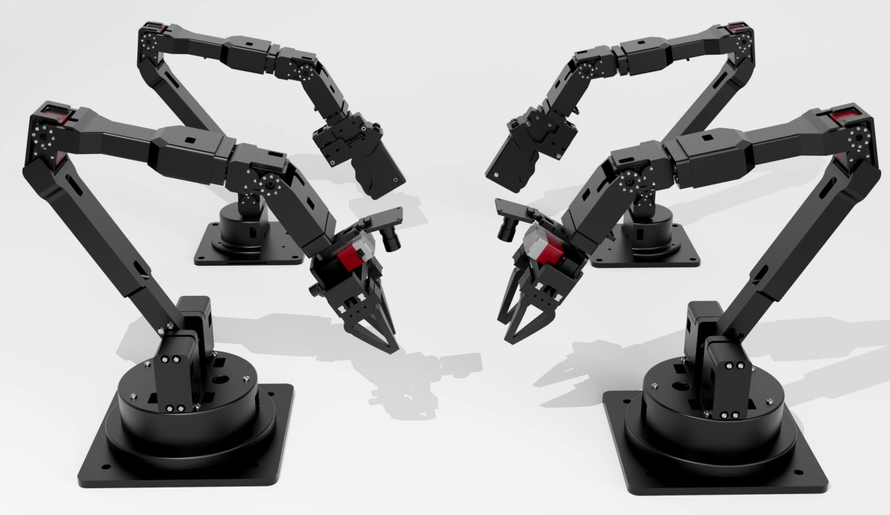

# 灵动 Alicia-D 系列机械臂

[English Version](README_en.md) | [中文版](README.md)



## 仓库结构

该仓库包含多个目录，每个目录包含与 Alicia Duo 机械臂相关的 ROS 包和资源。以下是仓库的结构：
```
├── alicia_duo_descriptions
├── alicia_duo_drag_teaching
├── alicia_duo_driver
├── alicia_duo_grasp_2d
├── alicia_duo_grasp_6d
├── alicia_duo_moveit
├── alicia_duo_ros_control

```

---

## 描述

### 机械臂类型：Alicia-D
Alicia-D 是一款多功能机械臂，设计用于多种应用场景。其模块化架构使其易于与 ROS 集成。

### 核心机械臂 ROS 包
这些是操作 Alicia-D 机械臂所需的核心 ROS 包：
- **`alicia_duo_driver`**: 提供与机械臂的底层控制和通信。
- **`alicia_duo_moveit`**: 配置机械臂以使用 MoveIt 进行运动规划和控制。
- **`alicia_duo_ros_control`**: 实现机械臂的 ROS 控制接口。
- **`alicia_duo_descriptions`**: 包含机械臂的 URDF 和网格文件，用于在 RViz 中可视化。
- **`alicia_duo_calibration`**: 提供手眼标定和其他校准工具。

### 示例机械臂 ROS 包
这些包基于核心包，展示了特定功能：
- **`alicia_duo_drag_teaching`**: 实现拖动示教功能。
- **`alicia_duo_grasp_2d`**: 展示机械臂的 2D 抓取能力。
- **`alicia_duo_grasp_6d`**: Alicia Duo机械臂 6D 抓取示例。
- **示例**: 包含学习和测试的示例脚本和演示：
  - **`alicia_duo_zero_calibration.py`**: 用于机械臂零点校准的 Python 脚本。


---

## 安装

`install` 目录包含安装脚本：
- **`alicia_amd64_install.sh`**: 基于ROS Noetic设置 Alicia Duo ROS 环境的脚本。


---
## 链接

- **淘宝店铺**: [Alicia-D 官方淘宝店](https://g84gtpygdv6trpvdhcsy0kfr73avcip.taobao.com/shop/view_shop.htm?appUid=RAzN8HWKU5B7MfX6JjEWgkuNfftNVbnrjbjx6fPjY9KqXB46Rvy&spm=a21n57.1.hoverItem.2)
- **产品手册**: [Alicia-D 产品手册](https://tcnqzgyay0jb.feishu.cn/wiki/ElDUwERlNilPLWkJ2e2cYGyZncb?fromScene=spaceOverview)

---
