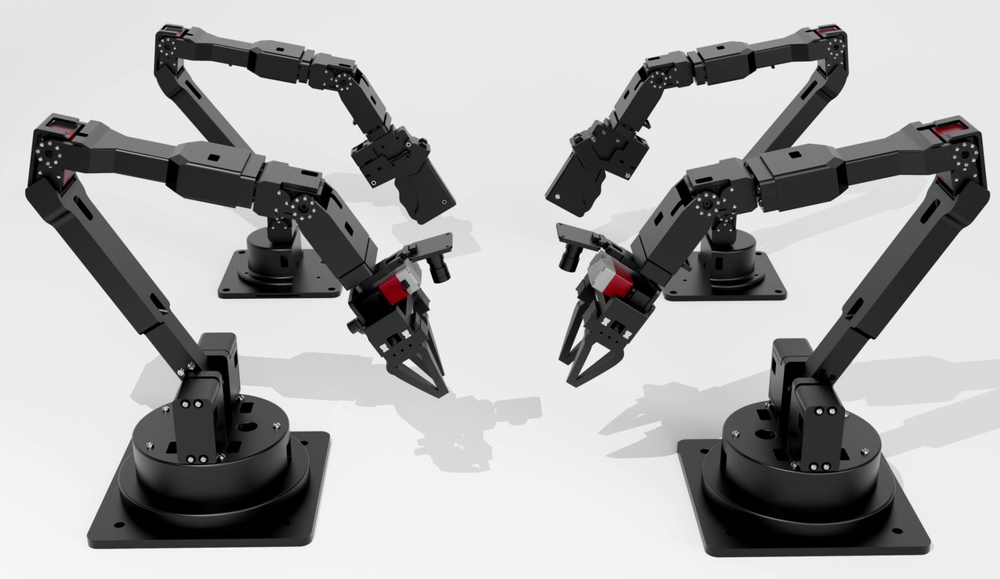

# 灵动 Alicia Duo 系列遥操作模仿学习数据采集平台



## 环境安装

**配置Linux基础依赖**

```jsx
安装串口依赖命令
sudo apt install python3-serial
获得串口操控权限
sudo usermod -aG dialout $USER
重启
sudo reboot 

安装mujoco支持
sudo apt install -y libosmesa6-dev libgl1-mesa-glx libglfw3 patchelf

一键安装指令 (参考ROS环境安装)
wget <http://fishros.com/install> -O fishros && . fishros

安装conda的延伸版本mamba
wget <https://repo.anaconda.com/miniconda/Miniconda3-latest-Linux-x86_64.sh> -O miniconda.sh

运行安装脚本
bash miniconda.sh

一键安装整个虚拟环境
mamba env create -f environment.yml
```

**获取代码**

```bash
安装git
sudo apt install git

下载基础工程
git clone <https://gitee.com/xuanyatech/Alicia_duo_ros.git>

编译工程
cd Alicia_duo_ros
catkin_make

把ROS工程加载进环境变量
vim ~/.bashrc
把下面这句添加进最后一行
source ~/Alicia_duo_ros/devel/setup.bash        
```

## 使用教程

ROS以及DP代码包结构介绍：

```bash
.
├── src
│   ├── diffusion_policy_obs          # ros数据集采集，数据实时上传
│   ├── error_frame_deal_pkg          # 错误信息节点处理话题 'error_frame_deal'
│   ├── frame_msgs                    # 自定义消息类型 msgs 包，类型 frame_msgs
│   ├── main_pkg                      # 控制中枢节点，发送或接收主控状态话题
│   ├── serial_data_type_pkg          # 串口数据中转节点，接收串口数据话题
│   ├── serial_server_pkg             # 串口服务器，处理串口数据发布与订阅
│   ├── servo_control_pkg             # 控制节点，浮点话题 'main_control_servo'
│   └── servo_states_pkg              # 反馈数据处理，浮点话题 'servo_states_main'
└── DP
```

以上为ROS的包文件结构，以下为DP算法的包文件结构。

```bash
DP/
├── data/
├── diffusion_policy/
│   ├── config/
│   │   ├── task/
│   │   │   ├── real_pusht_image.yaml # 模型输入格式配置
│   │   │   └── ……
│   │   ├── train_diffusion_unet_image_workspace.yaml # 训练配置文件
│   │   └── ……
├── multi_camera_real_robot_async.py # 异步控制机械臂
├── multi_camera_real_robot_sync.py  # 多相机同步控制机械臂
├── single_camera_real_robot_sync.py # 单相机同步控制机械臂
├── train.py # 训练模型
├── zarr_viz.py # 测试数据集的准确性
└── ……
```

## 可能的命令汇总

```bash
# 数据收集阶段命令
roscore # 启动ROS内核
roslaunch diffusion_policy_obs robot_obs_data.launch # 配置和启动多个 ROS 节点

rosrun diffusion_policy_obs single_camera_dataset.py # 打包数据生成数据集，适用于单个摄像头情况
rosrun diffusion_policy_obs multi_camera_dataset.py  # 打包数据生成数据集，适用于多个摄像头情况

# 数据测试阶段命令
rosrun diffusion_policy_obs read_test.py # 测试收集的数据动作与视频维度是否匹配

# 模型训练阶段命令
python train.py --config-name=train_diffusion_unet_real_image_workspace task.dataset_path=data/real_pusht

# 模型推理阶段命令
roscore # 启动ROS内核
roslaunch diffusion_policy_obs robot_obs_data.launch # 配置和启动多个 ROS 节点
rosrun diffusion_policy_obs single_camera_status.py # 打包数据生成数据集，适用于单个摄像头情况
rosrun diffusion_policy_obs multi_camera_status.py  # 打包数据生成数据集，适用于多个摄像头情况 
```