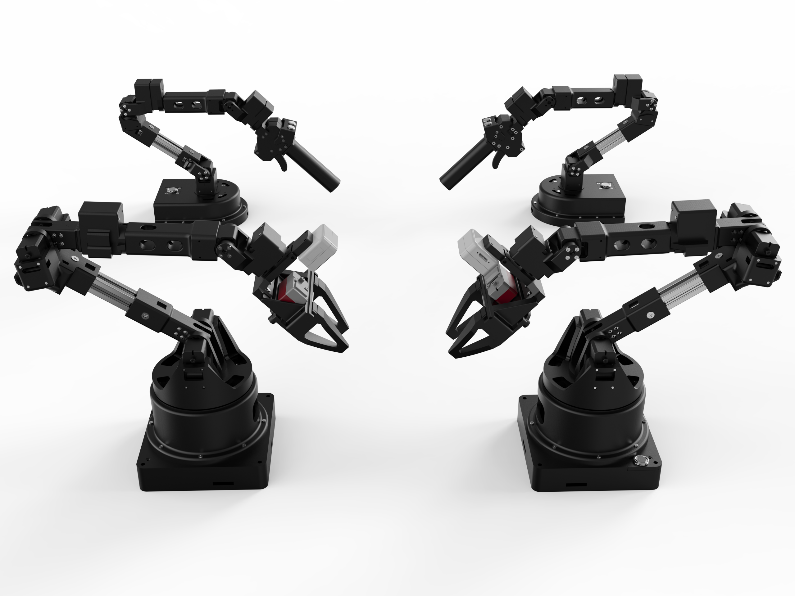

<<<<<<< HEAD
# Alicia-D Robotic Arm Series

[English Version](README_en.md) | [中文版](README.md)


## Repository Structure

This repository contains multiple directories, each including ROS packages and resources related to the Alicia-D manipulator. The structure is as follows:
```
├── alicia_duo_calibration
=======
# Alicia-D Series Robotic Arm by Xuanya Robotics

[English Version](README_en.md) | [中文版](README.md) | [Official Taobao Store](https://g84gtpygdv6trpvdhcsy0kfr73avcip.taobao.com/shop/view_shop.htm?appUid=RAzN8HWKU5B7MfX6JjEWgkuNfftNVbnrjbjx6fPjY9KqXB46Rvy&spm=a21n57.1.hoverItem.2) | [Alicia-D Product Manual (CN)](https://tcnqzgyay0jb.feishu.cn/wiki/ElDUwERlNilPLWkJ2e2cYGyZncb?fromScene=spaceOverview)



## **Overview**

**The Alicia-D series robotic arms by Xuanya Robotics offer a cost-effective and fully functional platform for teleoperation data collection and the reproduction of cutting-edge robotic algorithms such as imitation learning (IL), reinforcement learning (RL), and vision-language-action (VLA).**  
**This repository provides ROS1 code and examples for the single-arm manipulator of the Alicia-D series.**

[Taobao Purchase Link](https://e.tb.cn/h.h6jfG5QfQVm5Ndq?tk=7T1q4aGvWz1)

## **Installation**

### **Recommended System**

Tested configurations:

- Ubuntu 20.04
- ROS Noetic

### **Installation Steps**

Run the following command:

```bash
sh install/alicia_amd64_install.sh
```

## **Repository Structure**

This repository contains several directories, each including ROS packages and resources related to the Alicia-D robotic arm series. The structure is as follows:

```
Alicia-D-ROS1
>>>>>>> 31afcdaf8211c3b048ca078402a46a9b42c741da
├── alicia_duo_descriptions
├── alicia_duo_drag_teaching
├── alicia_duo_driver
├── alicia_duo_grasp_2d
<<<<<<< HEAD
├── alicia_duo_moveit
├── alicia_duo_ros_control

```

---

## Description

### Robotic Arm Type: Alicia Duo
Alicia-D is a versatile robotic arm designed for various applications. Its modular architecture makes it easy to integrate with ROS.

### Core Robotic Arm ROS Packages
These are the core ROS packages required to operate the Alicia Duo robotic arm:
- **`alicia_duo_driver`**: Provides low-level control and communication with the robotic arm.
- **`alicia_duo_moveit`**: Configures the robotic arm for motion planning and control using MoveIt.
- **`alicia_duo_ros_control`**: Implements the ROS control interface for the robotic arm.
- **`alicia_duo_descriptions`**: Contains the URDF and mesh files of the robotic arm for visualization in RViz.
- **`alicia_duo_calibration`**: Provides hand-eye calibration and other calibration tools.

### Example Robotic Arm ROS Packages
These packages are based on the core packages and demonstrate specific functionalities:
- **`alicia_duo_drag_teaching`**: Implements drag teaching functionality.
- **`alicia_duo_grasp_2d`**: Demonstrates the 2D grasping capability of the robotic arm.
- **Examples**: Includes example scripts and demos for learning and testing:
  - **`alicia_duo_zero_calibration.py`**: A Python script for zero-point calibration of the robotic arm.


---

## Installation

The `install` directory contains installation scripts:
- **`alicia_amd64_install.sh`**: A script to set up the Alicia Duo ROS environment based on ROS Noetic.


---
## Links

- **Taobao Store**: [Alicia-D Official Taobao Store](https://g84gtpygdv6trpvdhcsy0kfr73avcip.taobao.com/shop/view_shop.htm?appUid=RAzN8HWKU5B7MfX6JjEWgkuNfftNVbnrjbjx6fPjY9KqXB46Rvy&spm=a21n57.1.hoverItem.2)
- **Product Manual**: [Alicia-D Product Manual](https://tcnqzgyay0jb.feishu.cn/wiki/ElDUwERlNilPLWkJ2e2cYGyZncb?fromScene=spaceOverview)

---
=======
├── alicia_duo_grasp_6d
├── alicia_duo_moveit
├── alicia_duo_ros_control
```

### **Core ROS Packages**

- **`alicia_duo_driver`**: Provides low-level control and communication with the robot arm.
- **`alicia_duo_moveit`**: Configures the robotic arm for motion planning and control using MoveIt.
- **`alicia_duo_ros_control`**: Implements the ROS control interface for the robotic arm.
- **`alicia_duo_descriptions`**: Contains URDF and mesh files for visualization in RViz.
- **`alicia_duo_calibration`**: Offers tools for hand-eye calibration and other calibration procedures.

### **Functional Packages and Demos**

- **`alicia_duo_drag_teaching`**: Implements drag-teaching functionality.
- **`alicia_duo_grasp_2d`**: Demonstrates the arm’s ability to perform 2D grasping.
- **`alicia_duo_grasp_6d`**: 6D grasping examples using the Alicia-D robotic arm.
- **`examples`**: Includes scripts and demos for learning and testing:
  - **`alicia_duo_zero_calibration.py`**: Python script for zero-point calibration of the robotic arm.

## **Links**

- **Official Taobao Store**: [Alicia-D by Xuanya Robotics on Taobao](https://g84gtpygdv6trpvdhcsy0kfr73avcip.taobao.com/shop/view_shop.htm?appUid=RAzN8HWKU5B7MfX6JjEWgkuNfftNVbnrjbjx6fPjY9KqXB46Rvy&spm=a21n57.1.hoverItem.2)
- **Product Manual**: [Alicia-D Product Manual (Chinese)](https://tcnqzgyay0jb.feishu.cn/wiki/ElDUwERlNilPLWkJ2e2cYGyZncb?fromScene=spaceOverview)
>>>>>>> 31afcdaf8211c3b048ca078402a46a9b42c741da
