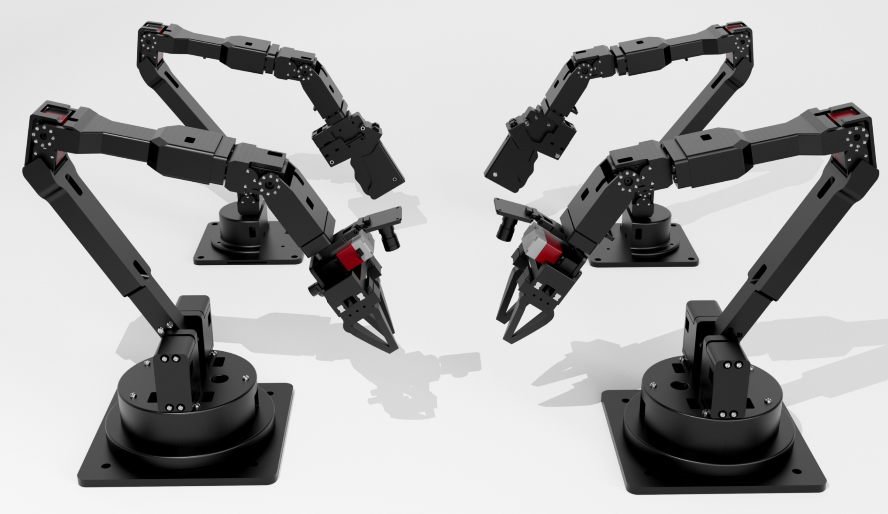

# Alicia Duo Robotic Arm Series

[English Version](README_en.md) | [中文版](README.md)



## Repository Structure

This repository contains multiple directories, each including ROS packages and resources related to the Alicia Duo robotic arm. The structure is as follows:
```
├── alicia_duo_calibration
├── alicia_duo_descriptions
├── alicia_duo_drag_teaching
├── alicia_duo_driver
├── alicia_duo_grasp_2d
├── alicia_duo_moveit
├── alicia_duo_ros_control

```

---

## Description

### Robotic Arm Type: Alicia Duo
Alicia Duo is a versatile robotic arm designed for various applications. Its modular architecture makes it easy to integrate with ROS.

### Core Robotic Arm ROS Packages
These are the core ROS packages required to operate the Alicia Duo robotic arm:
- **`alicia_duo_driver`**: Provides low-level control and communication with the robotic arm.
- **`alicia_duo_moveit`**: Configures the robotic arm for motion planning and control using MoveIt.
- **`alicia_duo_ros_control`**: Implements the ROS control interface for the robotic arm.
- **`alicia_duo_descriptions`**: Contains the URDF and mesh files of the robotic arm for visualization in RViz.
- **`alicia_duo_calibration`**: Provides hand-eye calibration and other calibration tools.

### Example Robotic Arm ROS Packages
These packages are based on the core packages and demonstrate specific functionalities:
- **`alicia_duo_drag_teaching`**: Implements drag teaching functionality.
- **`alicia_duo_grasp_2d`**: Demonstrates the 2D grasping capability of the robotic arm.
- **Examples**: Includes example scripts and demos for learning and testing:
  - **`alicia_duo_zero_calibration.py`**: A Python script for zero-point calibration of the robotic arm.


---

## Installation

The `install` directory contains installation scripts:
- **`alicia_amd64_install.sh`**: A script to set up the Alicia Duo ROS environment based on ROS Noetic.


---
## Links

- **Taobao Store**: [Alicia Duo Official Taobao Store](https://g84gtpygdv6trpvdhcsy0kfr73avcip.taobao.com/shop/view_shop.htm?appUid=RAzN8HWKU5B7MfX6JjEWgkuNfftNVbnrjbjx6fPjY9KqXB46Rvy&spm=a21n57.1.hoverItem.2)
- **Product Manual**: [Alicia Duo Product Manual](https://tcnqzgyay0jb.feishu.cn/wiki/DGtywN4j8ikctwk6PoccULllnkb)

---